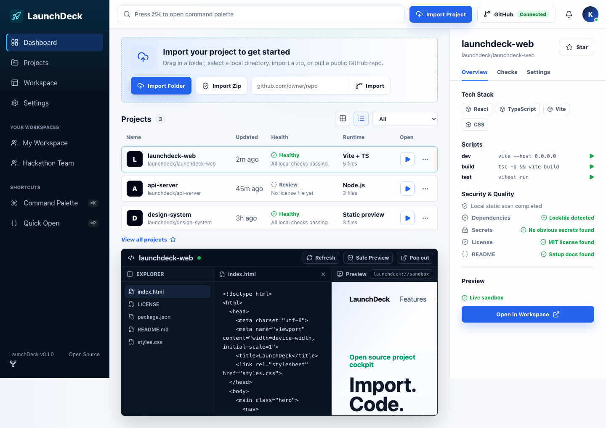

# LaunchDeck

**LaunchDeck is a local-first project cockpit for developers who want to import a project, inspect its health, edit files, and preview safely from one polished workspace.**



## Why It Exists

Most project dashboards are either marketing shells, cloud IDEs, or repo lists. LaunchDeck aims for the missing middle: a fast, open-source cockpit that gives every project a useful home before you decide to run code, install dependencies, or ship.

It is built for GitHub users, hackathon builders, maintainers, and indie devs who want a beautiful first mile for project onboarding.

## Highlights

- Import a local folder, zip archive, or public GitHub repo.
- Browse projects with runtime, stack, file count, and health signals.
- Open a coding workspace with file explorer, editor, terminal-style status, and live preview.
- Preview HTML safely in a sandboxed iframe with scripts blocked by default.
- Detect useful project metadata from `package.json`, README, lockfiles, license files, and obvious secret-like strings.
- Persist imported projects locally in the browser. No account or backend required.
- Tested with Vitest, Testing Library, Playwright, and axe-core.

## Quick Start

```bash
npm install
npm run dev
```

Production checks:

```bash
npm run check
npm run test:e2e
```

LaunchDeck uses system Google Chrome for Playwright in this repo so local e2e tests do not require downloading a bundled browser when Chrome is already installed.

## Safety Model

LaunchDeck is intentionally local-first:

- Imported file contents stay in browser state/localStorage.
- Binary and oversized files are skipped.
- File paths are normalized before display/storage.
- Preview iframes start with no script execution permissions.
- Safe preview documents include a restrictive Content Security Policy.
- GitHub import fetches public repository zipballs directly from GitHub.

Read the full model in [docs/SECURITY_MODEL.md](docs/SECURITY_MODEL.md).

## Current Status

LaunchDeck is a polished frontend prototype with a real import pipeline and local workspace model. It is not yet a cloud IDE, remote executor, package installer, or hosted collaboration service.

See [docs/ROADMAP.md](docs/ROADMAP.md) for the path toward a production-grade desktop/web developer cockpit.

## Contributing

Contributions are welcome. The highest-impact areas right now are:

- richer import intelligence for more frameworks
- safe preview adapters for common frontend stacks
- command palette actions
- keyboard navigation polish
- repository fixture tests
- design refinements for dense mobile states

Start with [CONTRIBUTING.md](CONTRIBUTING.md).

## License

MIT
